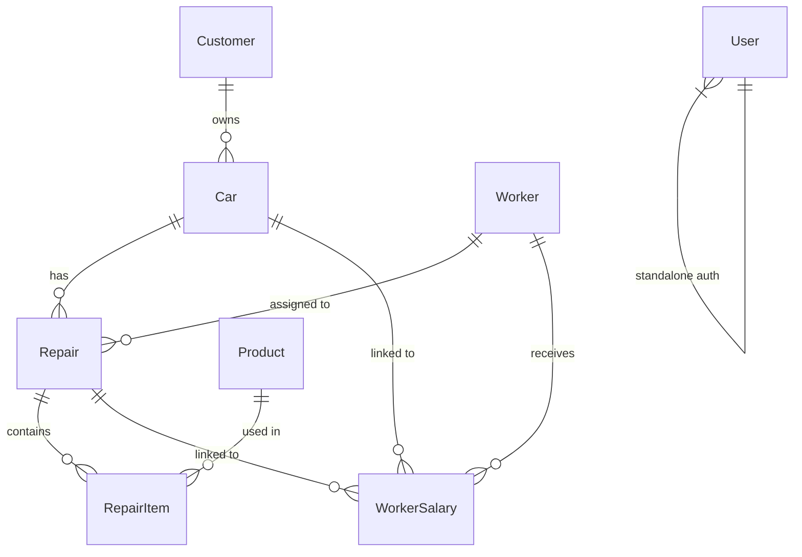

# Al-Khawarizmi Car System — Database Schema

## Overview

- **Database Engine**: SQLite 3 (development) / PostgreSQL (production)
- **ORM**: Django ORM (`django.db.models`)
- **Database File**: `db.sqlite3` (default SQLite)
- **Migrations**: Managed via `python manage.py makemigrations` / `python manage.py migrate`

All models are defined in `core/models.py`.

---

## Entity-Relationship Diagram



---

## Table Definitions (Django Models)

### 1. `Customer`

Stores customer information.

```python
class Customer(models.Model):
    name          = models.CharField(max_length=100)
    phone         = models.CharField(max_length=20, blank=True, null=True)
    customer_type = models.CharField(max_length=20, default='زبون',
                       choices=[('تاجر', 'تاجر'), ('زبون', 'زبون')])
    address       = models.CharField(max_length=200, blank=True, null=True)
    date_added    = models.DateTimeField(auto_now_add=True)

    def __str__(self):
        return self.name
```

| Column | Type | Constraints | Default | Description |
|---|---|---|---|---|
| `id` | `AutoField` | PRIMARY KEY | Auto | Unique customer ID |
| `name` | `CharField(100)` | NOT NULL | — | Customer name |
| `phone` | `CharField(20)` | NULLABLE | — | Phone number |
| `customer_type` | `CharField(20)` | choices | `'زبون'` | `'تاجر'` (trader) or `'زبون'` (customer) |
| `address` | `CharField(200)` | NULLABLE | — | Address |
| `date_added` | `DateTimeField` | `auto_now_add` | Now | Registration date |

**Reverse Relations:**
- `customer.car_set.all()` → all cars belonging to customer (or use `related_name='cars'`)

---

### 2. `Car`

Stores vehicle information linked to a customer.

```python
class Car(models.Model):
    customer      = models.ForeignKey(Customer, on_delete=models.PROTECT, related_name='cars')
    make          = models.CharField(max_length=50)
    model         = models.CharField(max_length=50, blank=True, null=True)
    year          = models.IntegerField(blank=True, null=True)
    license_plate = models.CharField(max_length=20, blank=True, null=True)
    vin           = models.CharField(max_length=50, blank=True, null=True)
    color         = models.CharField(max_length=30, blank=True, null=True)
    date_added    = models.DateTimeField(auto_now_add=True)

    def __str__(self):
        return f"{self.make} {self.model} - {self.license_plate}"
```

| Column | Type | Constraints | Default | Description |
|---|---|---|---|---|
| `id` | `AutoField` | PRIMARY KEY | Auto | Unique car ID |
| `customer_id` | `ForeignKey` | → `Customer`, `PROTECT` | — | Owner customer |
| `make` | `CharField(50)` | NOT NULL | — | Car manufacturer (e.g., Toyota) |
| `model` | `CharField(50)` | NULLABLE | — | Car model (e.g., Camry) |
| `year` | `IntegerField` | NULLABLE | — | Manufacturing year |
| `license_plate` | `CharField(20)` | NULLABLE | — | License plate number |
| `vin` | `CharField(50)` | NULLABLE | — | Vehicle Identification Number |
| `color` | `CharField(30)` | NULLABLE | — | Car color |
| `date_added` | `DateTimeField` | `auto_now_add` | Now | Date added to system |

---

### 3. `Repair`

Stores repair/service orders.

```python
class Repair(models.Model):
    STATUS_CHOICES = [
        ('pending', 'قيد الانتظار'),
        ('in_progress', 'قيد التنفيذ'),
        ('completed', 'مكتمل'),
        ('cancelled', 'ملغي'),
    ]

    car            = models.ForeignKey(Car, on_delete=models.PROTECT, related_name='repairs')
    worker         = models.ForeignKey('Worker', on_delete=models.SET_NULL,
                        null=True, blank=True, related_name='repairs')
    description    = models.TextField()
    status         = models.CharField(max_length=20, choices=STATUS_CHOICES, default='pending')
    date           = models.DateField(default=timezone.now)
    date_created   = models.DateTimeField(auto_now_add=True)
    date_completed = models.DateTimeField(null=True, blank=True)
    total_cost     = models.FloatField(default=0.0)
    mileage        = models.IntegerField(null=True, blank=True)
    notes          = models.TextField(blank=True, null=True)

    def __str__(self):
        return f"Repair #{self.id} - {self.car}"

    def save(self, *args, **kwargs):
        if self.status == 'completed' and not self.date_completed:
            self.date_completed = timezone.now()
        elif self.status != 'completed':
            self.date_completed = None
        super().save(*args, **kwargs)
```

| Column | Type | Constraints | Default | Description |
|---|---|---|---|---|
| `id` | `AutoField` | PRIMARY KEY | Auto | Unique repair ID |
| `car_id` | `ForeignKey` | → `Car`, `PROTECT` | — | Car being repaired |
| `worker_id` | `ForeignKey` | → `Worker`, `SET_NULL` | — | Assigned worker |
| `description` | `TextField` | NOT NULL | — | Problem description |
| `status` | `CharField(20)` | choices | `'pending'` | `pending`, `in_progress`, `completed`, `cancelled` |
| `date` | `DateField` | — | `timezone.now` | Repair date |
| `date_created` | `DateTimeField` | `auto_now_add` | Now | Record creation timestamp |
| `date_completed` | `DateTimeField` | NULLABLE | `None` | Completion timestamp |
| `total_cost` | `FloatField` | — | `0.0` | Total cost of all items |
| `mileage` | `IntegerField` | NULLABLE | — | Odometer reading (km) |
| `notes` | `TextField` | NULLABLE | — | Additional notes |

**Status Workflow:**
```
pending → in_progress → completed
                      → cancelled
```

---

### 4. `RepairItem`

Line items within a repair (parts, oils, labor).

```python
class RepairItem(models.Model):
    TYPE_CHOICES = [
        ('قطع غيار', 'قطع غيار'),
        ('زيوت', 'زيوت'),
        ('أخرى', 'أخرى'),
    ]
    PRICE_TYPE_CHOICES = [
        ('wholesale', 'جملة'),
        ('retail', 'قطاعي'),
    ]

    repair     = models.ForeignKey(Repair, on_delete=models.CASCADE, related_name='items')
    description = models.CharField(max_length=200)
    quantity   = models.IntegerField(default=1)
    price      = models.FloatField()
    total      = models.FloatField(default=0.0)
    item_type  = models.CharField(max_length=20, choices=TYPE_CHOICES, default='قطع غيار')
    product    = models.ForeignKey('Product', on_delete=models.SET_NULL,
                    null=True, blank=True, related_name='repair_items')
    price_type = models.CharField(max_length=20, choices=PRICE_TYPE_CHOICES,
                    null=True, blank=True)

    def save(self, *args, **kwargs):
        self.total = self.quantity * self.price
        super().save(*args, **kwargs)
```

| Column | Type | Constraints | Default | Description |
|---|---|---|---|---|
| `id` | `AutoField` | PRIMARY KEY | Auto | Unique item ID |
| `repair_id` | `ForeignKey` | → `Repair`, `CASCADE` | — | Parent repair |
| `description` | `CharField(200)` | NOT NULL | — | Item description |
| `quantity` | `IntegerField` | — | `1` | Quantity |
| `price` | `FloatField` | NOT NULL | — | Unit price |
| `total` | `FloatField` | — | `0.0` | `quantity × price` |
| `item_type` | `CharField(20)` | choices | `'قطع غيار'` | `'قطع غيار'`, `'زيوت'`, `'أخرى'` |
| `product_id` | `ForeignKey` | → `Product`, `SET_NULL` | — | Linked inventory product |
| `price_type` | `CharField(20)` | NULLABLE | — | `'wholesale'` or `'retail'` |

> **Note**: `on_delete=models.CASCADE` ensures items are deleted when parent repair is deleted.

---

### 5. `Product`

Inventory of spare parts and oils.

```python
class Product(models.Model):
    TYPE_CHOICES = [
        ('قطع غيار', 'قطع غيار'),
        ('زيوت', 'زيوت'),
    ]

    name            = models.CharField(max_length=100)
    description     = models.TextField(blank=True, null=True)
    price           = models.FloatField(default=0.0)       # Default sale price
    price_bought    = models.FloatField(default=0.0)       # Purchase cost
    wholesale_price = models.FloatField(default=0.0)
    retail_price    = models.FloatField(default=0.0)
    quantity        = models.IntegerField(default=0)        # Stock count
    product_type    = models.CharField(max_length=20, choices=TYPE_CHOICES, default='قطع غيار')
    date_added      = models.DateTimeField(auto_now_add=True)

    @property
    def profit(self):
        """سعر البيع - سعر الشراء"""
        return self.price - self.price_bought

    @property
    def profit_percentage(self):
        """نسبة الربح"""
        if self.price_bought > 0:
            return ((self.price - self.price_bought) / self.price_bought) * 100
        return 0

    @property
    def total_profit(self):
        """إجمالي الأرباح من جميع المبيعات المكتملة"""
        total = 0
        for item in self.repair_items.filter(repair__status='completed'):
            if item.price_type == 'wholesale':
                profit_per = self.wholesale_price - self.price_bought
            elif item.price_type == 'retail':
                profit_per = self.retail_price - self.price_bought
            else:
                profit_per = item.price - self.price_bought
            total += profit_per * item.quantity
        return total

    def __str__(self):
        return self.name
```

| Column | Type | Constraints | Default | Description |
|---|---|---|---|---|
| `id` | `AutoField` | PRIMARY KEY | Auto | Unique product ID |
| `name` | `CharField(100)` | NOT NULL | — | Product name |
| `description` | `TextField` | NULLABLE | — | Product description |
| `price` | `FloatField` | — | `0.0` | Default sale price |
| `price_bought` | `FloatField` | — | `0.0` | Purchase/cost price |
| `wholesale_price` | `FloatField` | — | `0.0` | Wholesale price |
| `retail_price` | `FloatField` | — | `0.0` | Retail price |
| `quantity` | `IntegerField` | — | `0` | Current stock quantity |
| `product_type` | `CharField(20)` | choices | `'قطع غيار'` | `'قطع غيار'` or `'زيوت'` |
| `date_added` | `DateTimeField` | `auto_now_add` | Now | Date added |

---

### 6. `Worker`

Worker/technician profiles.

```python
class Worker(models.Model):
    name       = models.CharField(max_length=100)
    phone      = models.CharField(max_length=20, blank=True, null=True)
    address    = models.CharField(max_length=200, blank=True, null=True)
    salary     = models.FloatField(default=0.0)
    date_added = models.DateTimeField(auto_now_add=True)

    def __str__(self):
        return self.name
```

| Column | Type | Constraints | Default | Description |
|---|---|---|---|---|
| `id` | `AutoField` | PRIMARY KEY | Auto | Unique worker ID |
| `name` | `CharField(100)` | NOT NULL | — | Worker name |
| `phone` | `CharField(20)` | NULLABLE | — | Phone number |
| `address` | `CharField(200)` | NULLABLE | — | Address |
| `salary` | `FloatField` | — | `0.0` | Monthly salary |
| `date_added` | `DateTimeField` | `auto_now_add` | Now | Date added |

---

### 7. `WorkerSalary`

Salary/payment records for workers.

```python
class WorkerSalary(models.Model):
    STATUS_CHOICES = [
        ('محفوظ', 'محفوظ'),
        ('مدفوع', 'مدفوع'),
        ('مخصوم', 'مخصوم'),
    ]

    worker       = models.ForeignKey(Worker, on_delete=models.CASCADE, related_name='salaries')
    car          = models.ForeignKey(Car, on_delete=models.SET_NULL,
                      null=True, blank=True, related_name='worker_salaries')
    repair       = models.ForeignKey(Repair, on_delete=models.SET_NULL,
                      null=True, blank=True, related_name='worker_salaries')
    amount       = models.FloatField()
    date         = models.DateField()
    status       = models.CharField(max_length=20, choices=STATUS_CHOICES, default='محفوظ')
    payment_date = models.DateTimeField(null=True, blank=True)
    notes        = models.TextField(blank=True, null=True)

    def __str__(self):
        return f"{self.worker.name} - {self.amount} - {self.date}"
```

| Column | Type | Constraints | Default | Description |
|---|---|---|---|---|
| `id` | `AutoField` | PRIMARY KEY | Auto | Unique salary record ID |
| `worker_id` | `ForeignKey` | → `Worker`, `CASCADE` | — | Worker receiving payment |
| `car_id` | `ForeignKey` | → `Car`, `SET_NULL` | — | Linked car (optional) |
| `repair_id` | `ForeignKey` | → `Repair`, `SET_NULL` | — | Linked repair (optional) |
| `amount` | `FloatField` | NOT NULL | — | Payment amount |
| `date` | `DateField` | NOT NULL | — | Salary date |
| `status` | `CharField(20)` | choices | `'محفوظ'` | `'محفوظ'` / `'مدفوع'` / `'مخصوم'` |
| `payment_date` | `DateTimeField` | NULLABLE | — | Actual payment timestamp |
| `notes` | `TextField` | NULLABLE | — | Notes |

---

### 8. `User` (Authentication)

**Option A — Use Django's built-in User** (simplest):
```python
from django.contrib.auth.models import User
# Already includes: username, password, is_active, date_joined
```

**Option B — Custom User model** (recommended for flexibility):
```python
from django.contrib.auth.models import AbstractUser

class User(AbstractUser):
    class Meta:
        db_table = 'auth_user'

# In settings.py:
AUTH_USER_MODEL = 'core.User'
```

Django handles password hashing automatically via `PASSWORD_HASHERS` (PBKDF2 by default, no length issues).

---

## Foreign Key Relationships Summary

| From Model | Field | → To Model | on_delete | Purpose |
|---|---|---|---|---|
| `Car` | `customer` | `Customer` | `PROTECT` | Prevent deleting customer with cars |
| `Repair` | `car` | `Car` | `PROTECT` | Prevent deleting car with repairs |
| `Repair` | `worker` | `Worker` | `SET_NULL` | Allow deleting worker, set null |
| `RepairItem` | `repair` | `Repair` | `CASCADE` | Delete items when repair deleted |
| `RepairItem` | `product` | `Product` | `SET_NULL` | Keep item if product deleted |
| `WorkerSalary` | `worker` | `Worker` | `CASCADE` | Delete salaries when worker deleted |
| `WorkerSalary` | `car` | `Car` | `SET_NULL` | Optional link |
| `WorkerSalary` | `repair` | `Repair` | `SET_NULL` | Optional link |

---

## Database Initialization

```bash
# Create migrations from models
python manage.py makemigrations core

# Apply migrations to database
python manage.py migrate

# Create superuser (admin)
python manage.py createsuperuser
```

## Database Backup & Restore

- **Backup**: Django management command or direct download of `db.sqlite3`
- **Restore**: Upload replacement `.db` file via admin view
- Use `python manage.py dumpdata --indent 2 > backup.json` for JSON backup
- Use `python manage.py loaddata backup.json` for JSON restore
